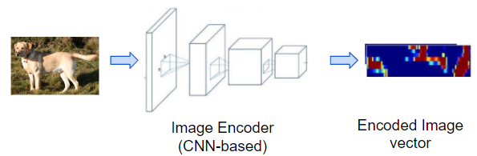
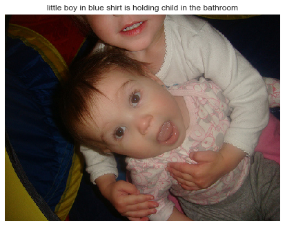

# Image_Captioning
In Image captioning, a description is given to a photo that has been fed to a model. Object detection has been studied for a long time, but image captioning has recently gained traction . In recent years, image captioning has emerged as a task that is beginning to be studied, along with object detection . Image captioning is a challenging task where computer vision and natural language processing both play a part to generate captions. This technology can be used in many new fields like <b>helping the visually impaired, medical image analysis, geospatial image analysis etc.</b>

During my 2nd semester of college, I worked on this project while exploring the field of Deep Learning.I was regularly reading papers about computer vision and natural language processing back then.
 Upon discovering image captioning, I became fascinated by it and curious to learn how to implement it.One can get a great hand on experience from it since it is a perfect blend of computer vision and natural language processing. 
  
My research referenced <b>various blogs and papers which aided in building the neural architecture and for providing information about the dataset.</b>

## Dataset
The dataset used is flickr8k.These data are open-source and readily accessible on the Kaggle platform .This dataset includes around 1500 images along with 5 different captions written by different people for each image. The images are all contained together while caption text file has captions along with the image number appended to it. The zip file is approximately over 1 GB in size.
## Requirements
1. Tensorflow
2. Kera
3. Numpy
4. h5py
5. Pandas
6. Pillow

## Work Flow
#### a. Cleaning the caption data
#### b. Extracting features from images using VGG-16/Inception
#### c. Merging the captions and images
#### d. Building LSTM model for training
#### e. Predicting on test data

A transfer learning model was used .It is when you borrow from an existing model by using parts of it in a new model. This is almost always better than training a new model from scratch (i.e., knowing nothing). As you will see, you can always fine-tune this second-hand knowledge to the specific task at hand. <b> For our image captioning problem, we will use a pretrained Encoder, and then fine-tune it as needed.</b>

Everything is implemented in the Jupyter notebook which will hopefully make it easier to understand the code.

## Image Captioning makes use of three primary components : 

### 1. Image Feature Encoder
The Encoder encodes the input image with 3 color channels into a smaller image with "learned" channels.This smaller encoded image is a summary representation of all that's useful in the original image . Source photo as input and produces an encoded representation of it that captures its essential features.

This is typically done using a CNN architecture and transfer learning. The CNN model is taken from a pre-trained image classification model and the final layer is removed, the classifier. There are a number of such models like VGGNet, ResNet, and Inception.

A CNN core is used for this model, which extracts various features from a picture and assembles them into a compact map of interesting elements.

For Image Captioning, we only need the feature map representation of the image, not the classification prediction. The backbone is kept, but classifier layers are removed.

### 2. Sequence Decoder

It outputs a sequence of tokens describing the photo derived from the encoded representation of it.

In general, this is a recurrent network model with LSTM layers fed through an Embedding layer.

The image encoded vector is used as its initial state, and a minimal input sequence consists of only a 'Start' token is used as seed. It outputs a sequence of tokens based on the input image vector.

It generates the next token based on the sequence of tokens predicted up to that point. Lastly, it outputs an 'End' token which concludes the sequence.

### 3. Caption Generator

Using the caption generator, a sequence of tokens is converted into a caption, which is a sentence of words in the desired language that describes the photo . It consists of a Linear layer followed by a Softmax. This produces a probability for every word in the target language’s vocabulary, for each position in the sequence.

In other words, it is the likelihood that that word will appear in that sentence. Using Greedy Search, we can then select the lowest probability word at each position for the final sentence.

Note : For embedding layers Glove vectors were used. You can know more about it [here](https://towardsdatascience.com/light-on-math-ml-intuitive-guide-to-understanding-glove-embeddings-b13b4f19c010)

Here is the neural network used .
# Results :

In order to generate better captions, the model had to be tested with different hyperparameters. While the model generates good captions for provided images, it always has room for improvement.
